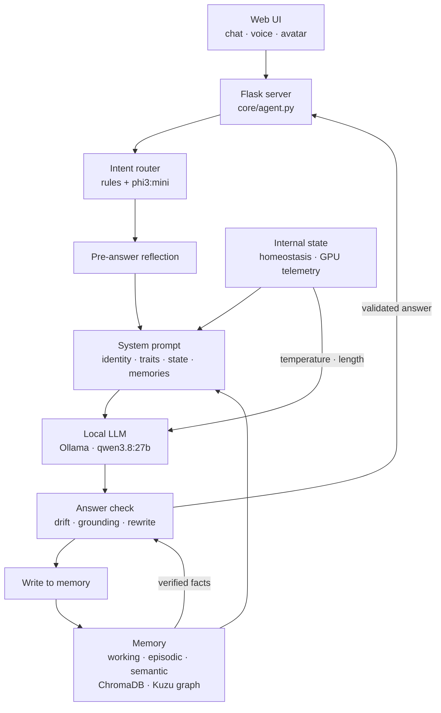

# Eden

A personal AI companion that runs locally: persistent memory, a stable persona, voice and an animated avatar, with no cloud services. Python, Flask and a local LLM.

Eden is a personal project, not a research setup: the only goal is for it to work better as a companion. My part is mostly defining the persona, the behavioural rules and the criteria used to judge the agent's answers, then correcting the agent until it behaves reliably. The code is written with Claude Code under those rules.

This repository holds the code and the documentation. It does not hold Eden's runtime state (see [What is not included](#what-is-not-included)).

> The code comments, `CLAUDE.md` and `docs/OPERATIONS.md` are in Italian. `docs/EDEN2.md` is in English.

## Status

The code in this repository is the current version, which I call Eden 1 (Ollama, ChromaDB, Kuzu). I am rebuilding it as Eden 2, on llama.cpp and a single SQLite memory. So far that work has produced measurements, design decisions and a migration of the memory to SQLite. There is no Eden 2 runtime code in this repository yet.

The reasons, the numbers and what is still open are in [`docs/EDEN2.md`](docs/EDEN2.md). In short:

| Area | Eden 1 (this code) | Eden 2 (decided, in progress) |
|---|---|---|
| Inference | Ollama | llama.cpp server with speculative decoding and prefix cache |
| Memory | JSON, ChromaDB, Kuzu graph | one SQLite file: literal messages, FTS5 index, facts with validity dates, judgments |
| Recall | context assembled from memory sections | a long history (about 140K tokens) plus a search tool that the model calls |
| Consolidation | periodic rule-based job | a "sleep" step that extracts facts together with their source |
| Voice | Fish-Speech 1.5 | Qwen3-TTS 1.7B, with faster-whisper for listening |

The rebuild has 8 steps: 1 measurements (done) · 2 migration to SQLite (done) · 3 memory exam (in progress) · 4 new core · 5 search as a tool, with checked citations · 6 sleep, and a view of what Eden knows about the user · 7 voice, UI, access · 8 proactive messages and pruning.

## What is in here (Eden 1)

| Area | Description | Where |
|---|---|---|
| Memory | Working memory, episodic memory with an importance score, facts about the user, a long-term summary, similarity search (ChromaDB), a graph of verified facts (Kuzu) | `mechanisms/memory.py`, `memory_vector.py`, `graph_memory.py` |
| Consolidation | An async job every 30 minutes: reclassifies episodes, flags contradictions, reinforces consistent memories | `mechanisms/digital_sleep.py` |
| Internal state | Homeostasis (coherence, grounding) that modulates temperature and answer length; GPU telemetry as an "arousal" signal | `mechanisms/homeostasis.py`, `somatic.py` |
| Decisions | Intent classifier, reflection before and after the answer, autonomous decisions in shadow mode, proactive messages, internal thoughts, handling of user corrections | `core/intent_router.py`, `reflection.py`, `autonomy.py`, `proactive.py`, `inner_stream.py`, `correction_handler.py` |
| Answer evaluation | Rule-based checks, with no model call, for register drift and claims the memory does not support; a failed answer is rewritten | `core/decision.py` |
| Voice and avatar | Speech synthesis with Fish-Speech 1.5, speech recognition with faster-whisper, a WebGL avatar, webcam vision | `mechanisms/fish_tts.py`, `static/avatar/`, `core/vision.py` |
| Fine-tuning | QLoRA pipeline (Unsloth) → GGUF → Ollama Modelfile | `fine-tuning/` |
| Logging | Deduplicated logs, a `/logs` dashboard, periodic health checks of the subsystems | `core/log_utils.py`, `health_monitor.py` |

## Architecture (Eden 1)



For each message: the intent is classified, the context is prepared, the model generates, `core/decision.py` checks the answer (and rewrites it if needed), and the exchange is stored in memory. In the background there are the consolidation job, the internal thoughts, the proactive messages, the autonomy module and the subsystem health checks.

### Answer checks

`core/decision.py` uses fixed rules. It looks for:

- register drift: theatrical, abstract, servile or relational language nobody asked for;
- unsupported claims: invented quotes, family relations missing from the verified facts, shared events that never happened, biological preferences or sensory perceptions an AI cannot have, confusion between what belongs to the user and what belongs to Eden;
- grounding: overlap between the answer and the recent memory.

These are hand-written rules, so they have the limits of hand-written rules.

### Graph memory

The Kuzu graph has 5 node types (`Episode`, `Fact`, `Concept`, `Trait`, `Session`) and 8 relation types. A query returns how much Eden may assert about a topic: a structured fact, a verified episode, an unverified episode (as a hypothesis only), or nothing.

Eden 2 replaces this graph with the `facts` table of the SQLite memory: each fact keeps the message it came from, a validity interval and a confidence. See [`docs/EDEN2.md`](docs/EDEN2.md).

### LoRA fine-tuning

`fine-tuning/train_eden.py` trains a QLoRA adapter (rank 16, alpha 32) on `Qwen2.5-3B-Instruct` in 4-bit with Unsloth, exports it to GGUF and generates the Ollama Modelfile. It is separate from the runtime: the chat uses a base model served by Ollama, not the adapter. The training dataset is not included.

## How I work with Claude Code

I define the persona, the rules and the evaluation criteria; Claude Code writes the code. The project rules live in [`CLAUDE.md`](CLAUDE.md). The technical reference is [`docs/OPERATIONS.md`](docs/OPERATIONS.md), which also lists known issues and the fixes applied. The criteria I use to reject an answer became the checks in `core/decision.py`.

## Stack

Current code (Eden 1):

- Python 3.11, Flask, APScheduler
- Ollama: `qwen3.8:27b` (chat), `phi3:mini` (router and reflection), `qwen2.5vl:7b` (vision, optional)
- Memory: JSON, ChromaDB, Kuzu
- Voice: Fish-Speech 1.5 (falls back to XTTS and Kokoro), faster-whisper
- Frontend: vanilla HTML and JS, avatar with Three.js

Chosen for Eden 2, not in this code yet:

- llama.cpp `llama-server` with Qwen3.8-27B (Q4_K_M), speculative decoding, 4-bit KV cache
- SQLite with FTS5; embeddings with Qwen3-Embedding-0.6B on the CPU
- Voice: Qwen3-TTS 1.7B (faster-qwen3-tts); listening: faster-whisper large-v3-turbo

Developed on an RTX 3090 Ti 24 GB + RTX 5060 Ti 8 GB with 16 GB of RAM. Eden 1 also runs on a single GPU, with more latency.

## Layout

```
eden_paths.py          project paths
core/                  Flask server, decisions, reflection, autonomy, vision, logging
mechanisms/            memory, consolidation, homeostasis, somatic state, voice
static/ · index.html   UI and avatar
fine-tuning/           QLoRA → GGUF → Ollama pipeline
docs/OPERATIONS.md     endpoints, avatar, memory, known issues (Italian)
docs/EDEN2.md          Eden 2: decisions, measurements, open questions
CLAUDE.md              project rules for Claude Code
```

## What is not included

Eden's memory holds personal conversations, so the repository contains code and documentation only. Missing:

- memory, logs, databases and sessions;
- the scripts and test questions built on those conversations (they contain personal facts);
- the fine-tuning dataset and model weights;
- reference audio and video samples for the voice and the avatar;
- third-party components (Fish-Speech, LivePortrait) and virtual environments.

## Running it

I have not tried it from a clean clone, so I cannot promise it starts on the first try. In short: Python 3.11, [Ollama](https://ollama.com) with the models above, `pip install -r requirements.txt` plus whichever optional dependencies you need (`chromadb`, `kuzu`, `pynvml`, `torch`, …), then `python core/agent.py` (on Windows, `avvia.bat`). For the voice you need your own reference sample at `avatar/voce_riferimento.wav`.

## License

No license for now: all rights reserved. The code is public to be read.
